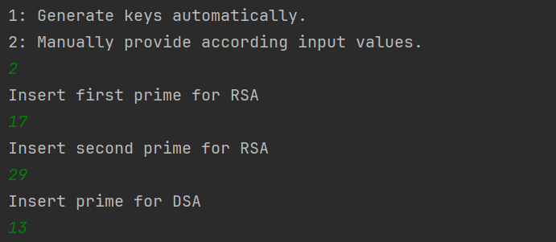
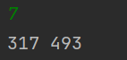
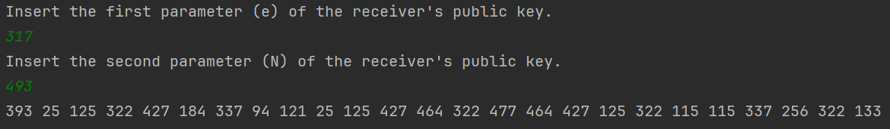
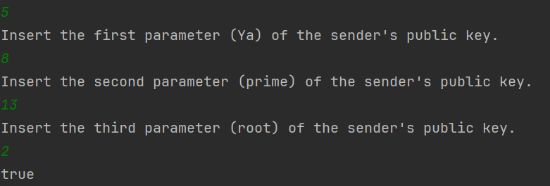
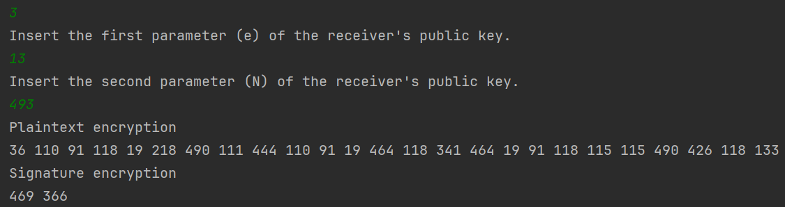
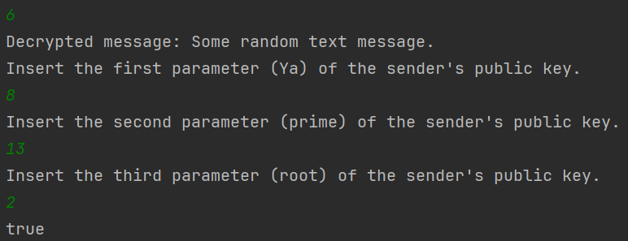

# safe-file-transfer

## Table of contents
* [DESCRIPTION](#DESCRIPTION)
* [HOW THE PROGRAM WORKS](#HOW THE PROGRAM WORKS)
* [IMPORTANT NOTES](#IMPORTANT NOTES)
* [HOW TO RUN THE PROGRAM](#HOW TO RUN THE PROGRAM)

## DESCRIPTION
    The program allows encryption, decryption, signature and verification of text files. 
    Using this program you can do encryption and decryption of a text file using RSA. 
    Sign the file and verify the signature by DSA algorithm.
    The hash function used is SHA 256.

## HOW THE PROGRAM WORKS
    The algorithm translates the text file consisting of valid ASCII characters into an array of longs, and
    treats each element of the array as a separate message, also allows to do both at the same time (sign and 
    encrypt, decrypt and verify). All necessary text files that should be used are located in the resources folder

## IMPORTANT NOTES
*   The messages should include only **ASCII** characters
*   The program is **NOT** practical for large keys (try to stick to max 3-digit keys) and long messages
*   The program **doesn't always validate the input**, so the user is expected to provide valid input
*   There are two options for key generation in RSA: automatic generator gives too large keys, so 
    we advise to use the custom generator, where you specify the prime numbers (p, q), keep them smaller 
    but make sure that the product of the input numbers is **larger than 128**, otherwise your input will be 
    ignored and the numbers will be generated by the automatic generator

*   If you are not done with the program make sure not to quit\, otherwise you have to perform all the
    actions again, since new private keys are generated everytime you run the program

## HOW TO RUN THE PROGRAM
### 1) Run the main method from the Main class:
*     You get two options for key generation:
  *         1. Automatic generation
  *         2. Manual input
      You are advised to choose option 2 (refer to IMPORTANT NOTES section for detailed explanation)
        
      You are asked to provide primes for RSA and DSA

       After you've inputted the prime numbers key generation is done automatically.
        
####    Then you are provided with 9 options
            1: Encrypt only.
            2: Sign only.
            3: Sign and encrypt.
            4: Decrypt only.
            5: Verify only.
            6: Decrypt and verify.
            7: Get RSA public key.
            8: Get DSA public key.
            9: Quit.    
        
*        You can choose options 7 and 8 to get the generated public keys before starting any process

####   If you want to only encrypt a message:
*       Copy the message into message_to_be_sent.txt file. Make sure to manually SAVE the message.

*       choose 1: You will be asked to insert the first, then second paramerters of the receivers public key.
        After insertion the cipthertext will be printed on the terminal and in textfile citphertext_to_be_sent.txt
       You are done with encryption.

        
####    If you want to only decrypt a message:
*        Copy the cyphertext into received_ciphertext.txt and SAVE

*        choose 4: You will get the decrypted message on terminal window and in received_message.txt.
      You are done with  decryption.

####    If you want to only sign the message:
*        Copy the message into message_to_be_sent.txt file. Make sure to manually SAVE the message.
*        choose 2: You will get the signature on terminal window and in signature_to_be_sent.txt, SAVE. 
 
        You are done with signing.

####    If you want to only verify the signature:
*        Copy the signature you need to verify into received_signature.txt and SAVE.  

*        choose 5: Insert Ya, prime, primitive root of the sender's public key
*        You get true if verification is passed and false otherwise.  
        You are done with verification.

###    Now let's get into doing two at the same time
####    If you want to sign and encrypt:
*        Copy the message you need to sign and encrypt
*        choose 3: insert the receiver's public key
        The encrypted plaintext and signature is printed on terminal and copied into signature_cipher_to_be_sent.txt
        and ciphertext_to_be_sent.txt
        You are done with signing and encryption.

####    If you want to decrypt and verify:
*        Copy signature into received_cipher_signature.txt, and message recieved_ciphertext.txt and SAVE

*        choose 6: message and signature are decrypted, then you need to insert the public signature key
         and the program will verify the signature for you
        You are done with decryption and verification.

#### QUIT
* After you're done with the program choose option 9 to terminate.
